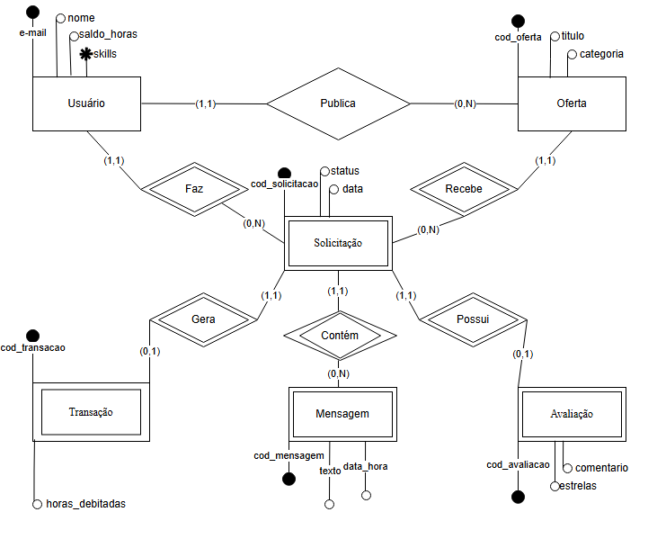
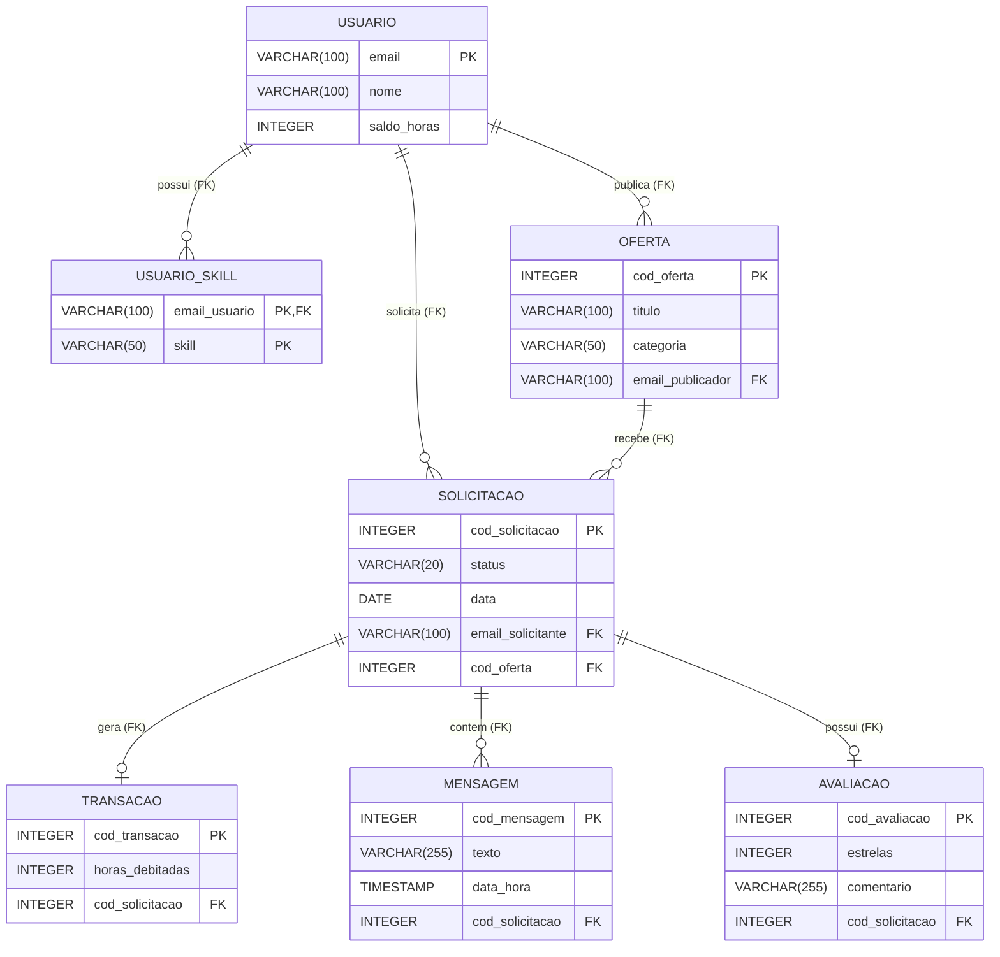

# Modelagem de Dados (DER)

Abaixo está o Modelo Conceitual e Físico do sistema Tempus, construído a partir do Backlog de produto. Ele mapeia as entidades fortes (Usuário e Oferta) e o fluxo de entidades fracas geradas durante a prestação do serviço (Solicitação, Transação, Mensagem e Avaliação).

